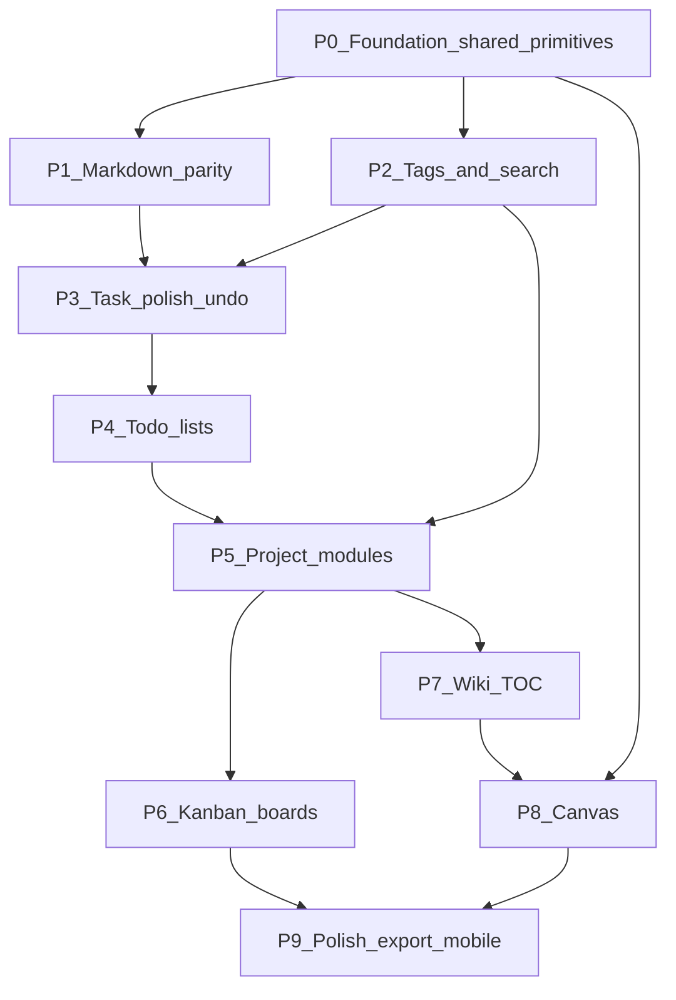

# TaskMesh: phased feature implementation (dependency-resolved)

A multi-phase roadmap that builds **shared UI/data primitives** first (element modes, color picker, Markdown, tags, autosave/undo), then layers To Do lists, configurable projects, Kanban, wiki TOC, and canvas—enriched with capabilities users expect from apps like **UpNote**, **Notion**, **Linear**, and **Lucidchart-class** tools—on top of the existing Express / Postgres / React foundation.

Source requirements: [feature_list.md](feature_list.md), [platform-rules](../rules/platform-rules.mdc).

---

## Current baseline

**Shipping today:** ideas/projects CRUD, convert idea→project, project documents, tasks with list DnD + due/color/phase assignment, basic MD editor + image upload button, confirm deletes.

**Missing or incomplete vs feature list:** shared rich Notes on tasks, autosave+undo, tags, To Do lists, per-project element modules, true Kanban boards, wiki TOC, canvas.

---

## Cross-cutting design (build once, reuse)

These shared packages should land early and be the **only** implementation of each concern:

| Primitive | Used by | Approach |
|-----------|---------|----------|
| **ColorPopover** | Tags, task accent, canvas shapes | Anchored popover; default **16-color** palette + optional custom hex; right-click / long-press; store `color` as CSS hex |
| **TagChip + TagInput** | All record types | Autocomplete after 3 chars; create-on-enter; hover ×; ColorPopover on context menu |
| **MarkdownEditor** | Documents, idea body, project description, **task notes** | One **TipTap**-based editor (migrating off `@uiw/react-md-editor`); toolbar + edit/preview; clipboard image paste → existing `/api/v1/uploads` |
| **ElementShell** | Task card / modal / fullscreen | Mode prop: `card` \| `modal` \| `page`; shared chrome (title, tags, delete confirm, dirty state) |
| **Autosave + UndoStack** | Tasks first, then docs | Blur/debounce save; local undo ring (10 steps) keyed by record id; baseline = open state |
| **Polymorphic links** | Tags, boards, wiki, todos | Prefer `(entityType, entityId)` join tables over per-type duplication |

### Commercial expectations to bake into UX

Drawn from UpNote / Notion / Linear / Trello / Lucid-class products:

- Global **search** (title + body + tags); keyboard **⌘/Ctrl+K** command palette (later)
- **Pin / favorite**, **recent**, empty states with one-click create
- Soft delete optional; always confirm hard delete (platform rule)
- Export Markdown/PDF (later); focus / distraction-free writing mode
- Board filters by tag/status; card quick-edit without leaving board
- Canvas: pan/zoom, snap, connectors, templates (architecture + ERD)

### Recommended libraries

- **Markdown:** **TipTap** (decided) — replace `@uiw/react-md-editor` in Phase 1; UpNote-like toolbar, tables, checklists, clipboard image paste
- **Kanban:** `@dnd-kit` (already in repo) — multi-container columns
- **Canvas:** **Excalidraw** (`@excalidraw/excalidraw`, MIT) for freeform mood boards + connectors; **Mermaid/D2** text→diagram for architecture/ERD (place onto Excalidraw); optional **xyflow** later for heavily structured graphs
- **Palette / popovers:** lightweight custom (dark grey / light green theme) rather than a heavy UI kit

---

## Phase 0 — Foundation and element model

**Estimate:** 1–2 weeks  
**Goal:** Stable contracts so later features don’t fork UI.

### Work

- Introduce `entity_type` enum convention: `idea` | `project` | `task` | `document` | `todo_list` | `board` | `canvas` | `wiki_node`
- Extend design tokens for **canvas darker background**, chip radii, focus rings
- Ship **ColorPopover** (+ a small playground route for manual QA)
- Ship **ElementShell** with modes; refactor Task expand UI to use `card` first
- Schema/docs housekeeping in [AGENTS.md](../../AGENTS.md)

### Exit criteria

- Shared color UI works on a demo chip
- ElementShell renders a task in card + modal

---

## Phase 1 — Markdown parity (UpNote-leaning)

**Estimate:** 1–2 weeks  
**Depends on:** uploads path (exists); ColorPopover optional; **TipTap migration** (decided — not optional) for UpNote-leaning Markdown parity (tables, checklists, clipboard image paste, shared editor for docs/ideas/task notes)

### Work

- Migrate shared **MarkdownEditor** to **TipTap** (replace `@uiw/react-md-editor`): headings, bold/italic/underline, links, lists, checklists, tables, alignment where feasible
- **Clipboard paste image** → upload API → insert ``
- Wire editor into: documents, ideas, project description, **task notes** (replace plain textarea)
- Optional: Focus mode (hide chrome); slash commands for headings/lists

### Exit criteria

- Task notes and Documents share one TipTap toolbar
- Paste image works end-to-end

---

## Phase 2 — Tags everywhere + search

**Estimate:** 1–2 weeks  
**Depends on:** ColorPopover (P0)

### Data

- `tags(id, name unique, color, created_at)`
- `taggings(tag_id, entity_type, entity_id)` unique composite
- Optional later: `palette_colors` for customizable 16-swatch sets

### API

- Tag CRUD; suggest `GET /tags?q=` (min 3 chars)
- Attach / detach tagging
- Search or filter by tag (`GET /search?q=` and/or `?tag=`)

### UI

- TagInput on idea / project / task / document
- Hover × to remove; right-click opens ColorPopover
- Global “browse by tag”

### Exit criteria

- Tag a task and an idea; search returns both
- Recolor tag updates all chips

---

## Phase 3 — Task interaction polish

**Estimate:** ~1 week  
**Depends on:** MarkdownEditor (P1); tags (P2 preferred)

### Work

- Autosave on blur/debounce for all task fields
- **Undo stack** (10 steps / session baseline) for open task editor
- Phase CRUD UI (create / rename / reorder — today only default “Main”)
- Keyboard: Enter add task, Esc collapse; confirm delete unchanged

### Exit criteria

- Edit notes, blur saves, Ctrl+Z restores prior note text without reload

---

## Phase 4 — To Do lists (polymorphic containers)

**Estimate:** 1–2 weeks  
**Depends on:** Tasks + Ideas stable; ElementShell

### Data

- `todo_lists(id, project_id nullable, title, …)`
- `todo_list_items(list_id, entity_type idea|task, entity_id, sort_order, checked?)`

### Behavior

- Lists hold Ideas and/or Tasks
- DnD reorder; open item in ElementShell modal
- Enrichment: unscoped “Inbox / My Day” list; convert checklist line → Task

### Exit criteria

- Create a list mixing ideas + tasks; reorder; open either type

---

## Phase 5 — Configurable project modules

**Estimate:** ~1 week  
**Depends on:** To Do lists, documents, tasks

### Work

- `project_modules(project_id, module_key, enabled, sort_order)`
  - Keys: `tasks` | `documents` | `todo_lists` | `boards` | `wiki` | `canvases`
- Project home: only enabled modules as tabs/sections
- Disabled modules show **Create / Enable** CTA (answer to feature_list: yes, show as opportunity)
- Deep links from project hub to each module

### Exit criteria

- One project with only Documents + Wiki; another with Tasks + Boards

---

## Phase 6 — Task Planning Boards (Kanban)

**Estimate:** 2–3 weeks  
**Depends on:** Tasks, tags, ElementShell, project modules

### Data

- `boards(project_id, name, …)` — multiple per project
- `board_columns(board_id, name, sort_order, wip_limit?)`
- `board_lanes(board_id, name, sort_order)` optional
- `board_cards(board_id, column_id, lane_id?, entity_type task|todo_item, entity_id, sort_order)`

### UI

- Multi-column `@dnd-kit`; editable columns/lanes
- Card → modal ElementShell; filter by tag
- Enrichment (Linear/Trello): WIP limits, card counts, keyboard move, “add task in column”

### Exit criteria

- Two boards on one project; drag across columns; edit task from card

---

## Phase 7 — Wiki + nested TOC

**Estimate:** ~2 weeks  
**Depends on:** Documents (+ canvas entity ids later); DnD patterns from boards

### Data

- `wiki_nodes(project_id, parent_id, entity_type document|canvas, entity_id, title, sort_order)` tree

### UI

- Left TOC tree; drag reorder / reparent
- Auto-create node when adding MD/canvas to wiki; breadcrumb
- Enrichment: collapse sections, pin pages, search within wiki subtree

### Exit criteria

- Nested TOC; drag page under another; open MD in main pane

---

## Phase 8 — Canvas (largest; split deliveries)

**Estimate:** 3–5 weeks total  
**Depends on:** ColorPopover; wiki can link canvas entities; uploads for mood-board images

### 8a — Freeform canvas MVP

- Persist Excalidraw scene JSON in `canvases(project_id, title, document jsonb, …)` (replaced tldraw)
- Darker grey background token
- Shape color via **same ColorPopover**
- Pan/zoom, basic shapes, images, connectors

### 8b — Smart layout assists

- Grid toggle + ColorPopover fill in TaskMesh chrome (Excalidraw built-in align UI); PNG/SVG export on assist bar

### 8c — Structured diagramming

- Templates: software architecture stencil set (Excalidraw libraries)
- ERD via **text markup** (Mermaid ER / D2) → preview + optional “place on canvas”
- Export PNG/SVG (shipped with Excalidraw swap; refine as needed)

### Exit criteria

- Mood board + architecture sketch saved on a project
- Shape colors match tag UX
- Wiki links to a canvas

---

## Phase 9 — Product polish

**Estimate:** ongoing / 1–2 week bursts  
**Depends on:** boards + canvas at least MVP

### Work

- Global search + **command palette** (Phase **9a**: Ctrl/Cmd+K + recent nav)
- Recent / pinned (palette recent in 9a; app-wide pin later)
- Mobile pass (touch DnD alternatives, bottom sheets for ElementShell)
- Export MD/PDF; reinforce backup of `data/uploads`
- Performance: virtualize long boards/lists; lazy-load canvas/editor chunks
- Accessibility: focus traps in modals, keyboard tag remove

### 9a — Command palette (shipped)

- Ctrl/Cmd+K overlay; debounced `GET /api/v1/search`
- Static go-to / create commands; `localStorage` recent paths
- Focus trap + keyboard navigation; slim top nav (Playground DEV-only)

## Phase 10 — Ops & reachability

### 10a — Import / export (shipped)

- Projects & Tasks CSV export; insert-only import; discard report for collisions + invalid rows

### 10b — Backup health UI (shipped)

- `/settings/backups`, `npm run backup`, restore + delete, in-process schedule, optional systemd timer under `deploy/`

### 10c — Responsive phone/tablet (shipped)

- Pixel ~412 / Tab S4 ~800–1030: scrollable tabs, stacked split panes, full-viewport sheets, touch targets, table scroll

### 10d — nginx :80 host (shipped)

- `HOST=127.0.0.1`, nginx → Express on :80, UFW LAN :80; future multi-app landing documented only

---

## Sequencing rationale

1. **Shared UI first** prevents three color pickers and three editors.
2. **Markdown + tags** unlock the “for-purchase notes app” feel before complex boards.
3. **To Do + project modules** define the product shell before Kanban/wiki.
4. **Kanban before canvas** reuses DnD and ElementShell; canvas is heaviest and ships last in slices.

---

## Repo implementation notes

- Extend [src/db/schema.ts](../../src/db/schema.ts) + `npm run db:generate` / `db:migrate` per phase
- Keep API under `/api/v1` with Zod + `{ error: { code, message } }`
- Extract `client/src/components/shared/*` (ColorPopover, TagInput, MarkdownEditor, ElementShell, UndoStack)
- Archive executed phase checklists to `.cursor/plans/executed/` per development rules
- At phase end: ship a user-facing QA checklist (step-by-step tests, `/dev/playground` when relevant, features to approve or tweak)

## Out of scope until later (platform rules)

- Auth / multi-user / realtime collaboration (Notion-style collab deferred)
- Public internet exposure hardening beyond private network + SSH tunnel
