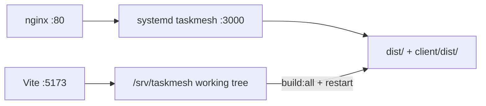

# Deploy current Dev to Production (:80)

## Context

Dev and Prod already share one tree on this host:

- **Dev:** `npm run dev:web` (Vite `:5173`, API via tsx).
- **Prod:** [`deploy/taskmesh.service`](deploy/taskmesh.service) runs `node dist/index.js` on `127.0.0.1:3000`; [`deploy/nginx-taskmesh.conf`](deploy/nginx-taskmesh.conf) proxies LAN **`:80`** → Express.
- Same `.env` / Postgres / `data/uploads/` — this is a **code promote**, not a data import.

Manual steps today are documented in [INSTALL.md §20](INSTALL.md) (`install` → `db:migrate` → `build:all` → `systemctl restart taskmesh`). The deliverable wraps that into one script.

**Default behavior:** deploy the **current working tree** (committed or dirty), matching “current Dev state.” Print branch, HEAD SHA, and dirty flag so the operator knows what went out.

## Deliverable

### 1. Script: [`deploy/deploy-prod.sh`](deploy/deploy-prod.sh)

Bash, `set -euo pipefail`, repo-root resolved from script location (`/srv/taskmesh`).

Steps:

1. Log start + `git rev-parse --abbrev-ref HEAD`, short SHA, and whether the tree is dirty.
2. `npm install` (root) and `npm install --prefix client` (runs Excalidraw `postinstall`).
3. `npm run db:migrate` (no-op if schema already applied; safe for UI-only deploys).
4. `npm run build:all` (API `dist/` + SPA `client/dist/`).
5. `sudo systemctl restart taskmesh`.
6. Wait briefly, then verify:
   - `curl -fsS http://127.0.0.1:3000/api/health`
   - `curl -fsS http://127.0.0.1/api/health` (nginx :80)
7. Exit non-zero on any failure; print clear next-step hints (`systemctl status taskmesh`, nginx 502 notes from INSTALL).

Flags (fixed set, no soft optionality in the happy path):

- `--skip-install` — skip npm installs when deps unchanged (faster iterate).
- `--skip-migrate` — skip migrations when operator knows schema is unchanged.
- Default path runs install + migrate + build + restart + health checks.

Do **not** stop Vite/dev:web; do **not** rewrite nginx/systemd units on every deploy (those stay one-time INSTALL steps). Do **not** touch `.env` or backups unless migrate/restart fails and docs point at troubleshooting.

### 2. npm script

In root [`package.json`](package.json):

- `"deploy:prod": "bash deploy/deploy-prod.sh"`

Usage: `npm run deploy:prod` or `npm run deploy:prod -- --skip-install`.

### 3. Docs

- Short subsection under [INSTALL.md §20 Updating TaskMesh](INSTALL.md): prefer `npm run deploy:prod` for same-host promote to :80; keep the expanded manual commands as fallback.
- One-line mention in [README.md](README.md) scripts table.

### 4. Prerequisite before first promote

Commit/push the pending Fast Refresh fix (`themeContext.ts` split) so Prod matches the fixed Dev console behavior, then run the new deploy script once and QA on `http://<host>/` (not `:5173`).

## Out of scope

- Separate prod checkout or second database
- CI/CD / remote SSH deploy to another machine
- Changing nginx listen port or multi-app path routing
- Automatic DB backup before every deploy (operator can `npm run backup` first if desired)

## QA after implementation

1. `npm run deploy:prod` completes with both health checks OK.
2. Browser: `http://<server-ip>/` shows the new three-pane shell (not stale pre–Phase 12 UI).
3. Settings gear → modal; theme switch; project Settings middle-nav.
4. Confirm `:5173` still works for ongoing Dev without needing a restart.
5. `systemctl is-active taskmesh` remains `active`.
