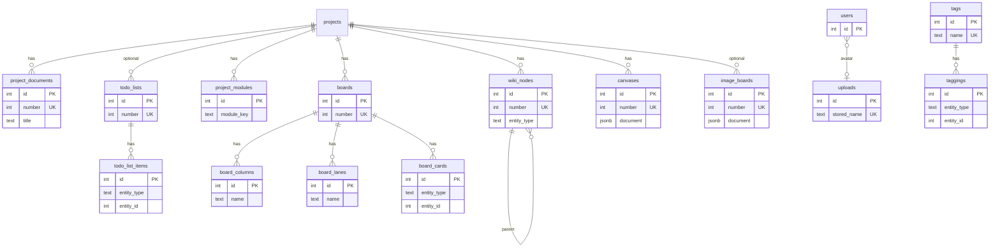

# Content and modules

Project content surfaces: documents, uploads, tags, todo lists, module toggles, Kanban boards, wiki TOC, Excalidraw canvases, and image boards. Source: [`src/db/schema.ts`](../../src/db/schema.ts).

Related: [overview](overview.md) · [projects and ideas](projects-and-ideas.md) · [glossary](glossary.md)

## Logical model

Polymorphic targets (`taggings`, `todo_list_items`, `board_cards`, `wiki_nodes`) use `entity_type` + `entity_id` without a database FK to the target row. See [glossary](glossary.md#polymorphic-entity-links).

---

## `project_documents`

Standalone Markdown documents owned by a project. Display number → **N####** (documents previously used D####; D is now ToDos).

### Columns

| Column | Type | Nullable | Default | Notes |
|--------|------|----------|---------|--------|
| `id` | serial | no | — | Primary key |
| `number` | integer | no | — | Display number (N####) |
| `project_id` | integer | no | — | FK → `projects.id` |
| `title` | text | no | — | |
| `body` | text | yes | — | Markdown |
| `position` | integer | no | `0` | Ordering within the project |
| `created_at` | timestamptz | no | `now()` | |
| `updated_at` | timestamptz | no | `now()` | |

### Constraints

- **PK:** `id`
- **UNIQUE:** `number`
- **FK:** `project_id` → `projects.id` · **ON DELETE CASCADE**

---

## `uploads`

Stored image (and similar) files on disk. Metadata only in Postgres; bytes live under `UPLOAD_DIR` (default `data/uploads/`).

### Columns

| Column | Type | Nullable | Default | Notes |
|--------|------|----------|---------|--------|
| `id` | serial | no | — | Primary key |
| `stored_name` | text | no | — | On-disk filename (UUID + extension) |
| `original_name` | text | no | — | Client filename |
| `mime_type` | text | no | — | |
| `size_bytes` | integer | no | — | |
| `created_at` | timestamptz | no | `now()` | |

### Constraints

- **PK:** `id`
- **UNIQUE:** `stored_name`

### Relationships

- Referenced by `users.avatar_upload_id` (`ON DELETE SET NULL`) — see [platform](platform.md).

---

## `tags` / `taggings`

Global tag catalog plus polymorphic attachments.

### `tags` columns

| Column | Type | Nullable | Default | Notes |
|--------|------|----------|---------|--------|
| `id` | serial | no | — | Primary key |
| `name` | text | no | — | Unique tag label |
| `color` | text | yes | — | Accent |
| `created_at` | timestamptz | no | `now()` | |

**Constraints:** PK `id`; UNIQUE `name`. Referenced by `task_groups.auto_tag_id` (`ON DELETE SET NULL`).

### `taggings` columns

| Column | Type | Nullable | Default | Notes |
|--------|------|----------|---------|--------|
| `id` | serial | no | — | Primary key |
| `tag_id` | integer | no | — | FK → `tags.id` |
| `entity_type` | text | no | — | Canonical `EntityType` string |
| `entity_id` | integer | no | — | Target row id (no DB FK) |

**Constraints:**

- **PK:** `id`
- **UNIQUE:** `(tag_id, entity_type, entity_id)` — `taggings_tag_entity_uidx`
- **FK:** `tag_id` → `tags.id` · **ON DELETE CASCADE**

---

## `todos`

First-class **ToDo** records (UI label “ToDo”). Display number → **D####**. Lighter than Task: due date, priority, Task-parity state, and `action_by` datetime. Optional `project_id` and `source_idea_id` (when converted from an Idea). Soft-delete via `state = 'deleted'`.

### Columns

| Column | Type | Nullable | Default | Notes |
|--------|------|----------|---------|--------|
| `id` | serial | no | — | Primary key |
| `project_id` | integer | yes | — | FK → `projects.id`; null = unassigned |
| `number` | integer | no | — | Display number (D####) |
| `title` | text | no | — | |
| `description` | text | yes | — | Markdown notes |
| `state` | text | no | `'new'` | Same values as `tasks.state` |
| `priority` | text | no | `'none'` | Same values as `tasks.priority` |
| `due_date` | date | yes | — | Date-only due |
| `action_by` | timestamptz | yes | — | When to act |
| `color` | text | yes | — | |
| `sort_order` | integer | no | `0` | |
| `source_idea_id` | integer | yes | — | FK → `ideas.id` · ON DELETE SET NULL |
| `created_by_id` | integer | no | — | FK → `users.id` · ON DELETE RESTRICT |
| `updated_by_id` | integer | no | — | FK → `users.id` · ON DELETE RESTRICT |
| `created_at` | timestamptz | no | `now()` | |
| `updated_at` | timestamptz | no | `now()` | |

**Constraints:** PK `id`; UNIQUE `number`; FKs as above.

---

## `todo_lists` / `todo_list_items`

Checklist containers (standalone or project-scoped) with polymorphic rows. Display number → **L####**.

New memberships use **`todo`** or **`task`**. Legacy **`idea`** rows may remain (no automatic migration); Ideas are managed on the Ideas UI.

### `todo_lists` columns

| Column | Type | Nullable | Default | Notes |
|--------|------|----------|---------|--------|
| `id` | serial | no | — | Primary key |
| `number` | integer | no | — | Display number (L####) |
| `project_id` | integer | yes | — | FK → `projects.id`; null = standalone |
| `title` | text | no | — | |
| `kind` | text | no | `'list'` | List kind discriminator |
| `created_at` | timestamptz | no | `now()` | |
| `updated_at` | timestamptz | no | `now()` | |

**Constraints:** PK `id`; UNIQUE `number`; FK `project_id` → `projects.id` · **ON DELETE CASCADE**.

### `todo_list_items` columns

| Column | Type | Nullable | Default | Notes |
|--------|------|----------|---------|--------|
| `id` | serial | no | — | Primary key |
| `list_id` | integer | no | — | FK → `todo_lists.id` |
| `entity_type` | text | no | — | Polymorphic type (`todo` \| `task`; legacy `idea`) |
| `entity_id` | integer | no | — | Polymorphic id |
| `sort_order` | integer | no | `0` | |
| `checked` | boolean | no | `false` | |
| `created_at` | timestamptz | no | `now()` | |
| `updated_at` | timestamptz | no | `now()` | |

**Constraints:**

- **PK:** `id`
- **UNIQUE:** `(list_id, entity_type, entity_id)` — `todo_list_items_list_entity_uidx`
- **FK:** `list_id` → `todo_lists.id` · **ON DELETE CASCADE**

---

## `project_modules`

Per-project enablement and ordering of hub modules (tasks, wiki, boards, …).

### Columns

| Column | Type | Nullable | Default | Notes |
|--------|------|----------|---------|--------|
| `id` | serial | no | — | Primary key |
| `project_id` | integer | no | — | FK → `projects.id` |
| `module_key` | text | no | — | Module identifier string |
| `enabled` | boolean | no | `true` | |
| `sort_order` | integer | no | `0` | |
| `created_at` | timestamptz | no | `now()` | |
| `updated_at` | timestamptz | no | `now()` | |

### Constraints

- **PK:** `id`
- **UNIQUE:** `(project_id, module_key)` — `project_modules_project_key_uidx`
- **FK:** `project_id` → `projects.id` · **ON DELETE CASCADE**

---

## Boards (`boards`, `board_columns`, `board_lanes`, `board_cards`)

Kanban planning boards (multiple per project). Display number → **B####**. Cards point at entities (typically tasks) via polymorphism.

### `boards`

| Column | Type | Nullable | Default | Notes |
|--------|------|----------|---------|--------|
| `id` | serial | no | — | Primary key |
| `number` | integer | no | — | Display number (B####) |
| `project_id` | integer | no | — | FK → `projects.id` · CASCADE |
| `name` | text | no | — | |
| `sort_order` | integer | no | `0` | |
| `created_at` | timestamptz | no | `now()` | |
| `updated_at` | timestamptz | no | `now()` | |

### `board_columns`

| Column | Type | Nullable | Default | Notes |
|--------|------|----------|---------|--------|
| `id` | serial | no | — | Primary key |
| `board_id` | integer | no | — | FK → `boards.id` · CASCADE |
| `name` | text | no | — | |
| `sort_order` | integer | no | `0` | |
| `wip_limit` | integer | yes | — | Optional WIP limit |
| `created_at` / `updated_at` | timestamptz | no | `now()` | |

### `board_lanes`

| Column | Type | Nullable | Default | Notes |
|--------|------|----------|---------|--------|
| `id` | serial | no | — | Primary key |
| `board_id` | integer | no | — | FK → `boards.id` · CASCADE |
| `name` | text | no | — | |
| `sort_order` | integer | no | `0` | |
| `created_at` / `updated_at` | timestamptz | no | `now()` | |

### `board_cards`

| Column | Type | Nullable | Default | Notes |
|--------|------|----------|---------|--------|
| `id` | serial | no | — | Primary key |
| `board_id` | integer | no | — | FK → `boards.id` · CASCADE |
| `column_id` | integer | no | — | FK → `board_columns.id` · CASCADE |
| `lane_id` | integer | yes | — | FK → `board_lanes.id` · **SET NULL** |
| `entity_type` | text | no | — | Polymorphic type |
| `entity_id` | integer | no | — | Polymorphic id |
| `sort_order` | integer | no | `0` | |
| `created_at` / `updated_at` | timestamptz | no | `now()` | |

**Unique:** `(board_id, entity_type, entity_id)` — `board_cards_board_entity_uidx` (one card per entity per board).

---

## `wiki_nodes`

Nested wiki table-of-contents nodes pointing at documents or canvases (via polymorphism). Display number → **W####**.

### Columns

| Column | Type | Nullable | Default | Notes |
|--------|------|----------|---------|--------|
| `id` | serial | no | — | Primary key |
| `number` | integer | no | — | Display number (W####) |
| `project_id` | integer | no | — | FK → `projects.id` · CASCADE |
| `parent_id` | integer | yes | — | Self-FK · **ON DELETE CASCADE** |
| `entity_type` | text | no | — | Target type (`document`, `canvas`, …) |
| `entity_id` | integer | no | — | Target id |
| `title` | text | no | — | TOC label |
| `sort_order` | integer | no | `0` | |
| `pinned` | boolean | no | `false` | |
| `created_at` / `updated_at` | timestamptz | no | `now()` | |

### Constraints

- **UNIQUE:** `number`
- **UNIQUE:** `(project_id, entity_type, entity_id)` — `wiki_nodes_project_entity_uidx`

---

## `canvases`

Freeform Excalidraw documents scoped to a project. Display number → **C####**.

### Columns

| Column | Type | Nullable | Default | Notes |
|--------|------|----------|---------|--------|
| `id` | serial | no | — | Primary key |
| `number` | integer | no | — | Display number (C####) |
| `project_id` | integer | no | — | FK → `projects.id` · CASCADE |
| `title` | text | no | — | |
| `sort_order` | integer | no | `0` | |
| `document` | jsonb | no | `{}` | Excalidraw scene JSON |
| `created_at` / `updated_at` | timestamptz | no | `now()` | |

**Constraints:** PK `id`; UNIQUE `number`.

---

## `image_boards`

PureRef-style image boards; optional project association. Display number → **M####**.

### Columns

| Column | Type | Nullable | Default | Notes |
|--------|------|----------|---------|--------|
| `id` | serial | no | — | Primary key |
| `number` | integer | no | — | Display number (M####) |
| `project_id` | integer | yes | — | FK → `projects.id` · **ON DELETE SET NULL** |
| `title` | text | no | — | |
| `sort_order` | integer | no | `0` | |
| `document` | jsonb | no | `{}` | Scene JSON (camera, items, …) |
| `created_at` / `updated_at` | timestamptz | no | `now()` | |

**Constraints:** PK `id`; UNIQUE `number`.
