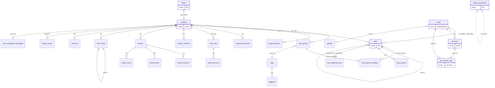

# Database schema overview

TaskMesh stores application data in **PostgreSQL**. The application maps tables with **Drizzle ORM** in [`src/db/schema.ts`](../../src/db/schema.ts). Migrations live under [`drizzle/`](../../drizzle/).

This documentation is for administrators and developers. It is deliberately human-readable (no SQL dumps). Physical detail for **main domain** tables appears on the domain pages; **platform / non-main** tables are listed in [platform.md](platform.md) and appear only as compact nodes on diagrams.

## How to read these docs

| Layer | Where | What you get |
|-------|--------|----------------|
| **Conceptual** | This page | Broad product relationships |
| **Logical** | Domain pages | Entities, key attributes, exact foreign keys |
| **Physical** | Domain pages (main tables) | Column types, nullability, defaults, uniques / delete behavior |

Start here, then open the domain page for the area you are changing. Shared terms are in the [glossary](glossary.md).

## Main vs non-main tables

**Main domain** (full physical documentation):

`ideas`, `projects`, `task_groups`, `task_group_members`, `project_phases`, `tasks`, `task_activity`, `task_dependencies`, `task_description_templates`, `project_documents`, `uploads`, `tags`, `taggings`, `todo_lists`, `todo_list_items`, `project_modules`, `boards`, `board_columns`, `board_lanes`, `board_cards`, `wiki_nodes`, `canvases`, `image_boards`

**Non-main** (inventory + minimal on diagrams):

`users`, `api_keys`, `system_properties`, `api_request_logs`, `db_stats_snapshots`

## Conceptual model

At a high level, a **Project** is the hub. An **Idea** can become a project. Projects own task groups, project phases, tasks, documents, module toggles, boards, wiki nodes, and canvases. Tasks may also exist outside a project (unsorted / list-only). Tags and todo-list rows attach to entities via polymorphic `(entity_type, entity_id)` pairs. Users and API keys support authorship and future auth; they are not the focus of product modeling.

Non-main entities (`users`, `api_keys`, `system_properties`, `api_request_logs`, `db_stats_snapshots`) are shown without full attribute catalogs. See [platform.md](platform.md).

## Domain pages

- [Projects and ideas](projects-and-ideas.md)
- [Tasks](tasks.md)
- [Content and modules](content-and-modules.md)
- [Platform tables](platform.md)
- [Glossary](glossary.md)

## Conventions that appear everywhere

- **Serial integer primary keys** (`id`) for most tables; `system_properties` uses `key` as PK.
- **Display numbers** — app-wide unique integers formatted as `I####`, `P####`, `T####`, etc. See [glossary](glossary.md#display-numbers).
- **Timestamps** — `created_at` / `updated_at` are `timestamptz`, usually `NOT NULL` with `now()` default.
- **Polymorphic links** — `entity_type` + `entity_id` (no DB-level FK to the target row). Canonical types live in application code (`EntityType`).
- **Cascade vs set null** — deleting a project typically cascades to owned children; optional links often use `ON DELETE SET NULL`. Exact behavior is listed per FK on domain pages.
