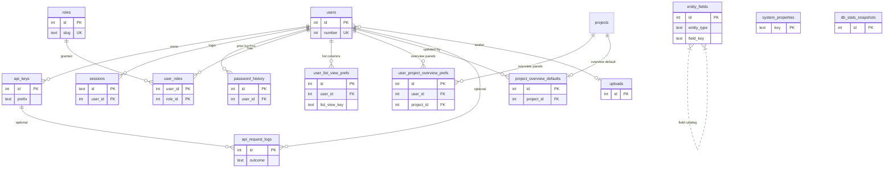

# Platform tables (non-main)

These tables support identity, API access, configuration, and audit logging. They are **not** fully catalogued as domain models here; see [`src/db/schema.ts`](../../src/db/schema.ts) for column-level detail when needed.

On ERDs they appear as compact stubs only. Main domain documentation: [overview](overview.md).

## Inventory

| Table | Purpose | Notable relationships |
|-------|---------|------------------------|
| `users` | App users. Display → **U####**. Email + scrypt password hash for login; avatar upload; lockout / last-login fields. Admins create users (next `U####`, required email + password), **lock** / **unlock** (`locked_at`, distinct from deactivate), and **hard-delete** when the user is not last remaining, not the signed-in user, not the last **Administrator**, and has no RESTRICT authorship/ownership (tasks/ToDos/`owner_id` on domain rows). Deactivate remains the path for users who have authored or own records. Failed sign-in increments `failed_login_count`; at `login_failure_threshold` the account is locked (`lock_reason=login_failures`). **MFA (T0139/T0140/T0146):** optional TOTP (`mfa_totp_secret_enc` AES-GCM with env `MFA_TOTP_KEY`, `mfa_enabled_at`); `mfa_totp_last_step` stores the last accepted TOTP time-step to reject replays in the ±30s window; hashed single-use recovery codes in `mfa_recovery_codes`; grace clock `mfa_grace_started_at`; MFA-deadline lock uses `lock_reason=mfa_deadline`. Admin may **clear MFA** (also wipes recovery codes and sessions). Hard-delete explicitly removes API keys, MFA config, sessions, recovery codes, and trusted devices (also CASCADE). Profile password change requires the current password and rejects reuse of any of the last **5** passwords (current + up to 4 rows in `password_history`). Admin reset-password **bypasses** reuse checks but still archives the previous hash. | Avatar → `uploads` (`ON DELETE SET NULL`). Referenced by `sessions`, `mfa_login_challenges`, `mfa_trusted_devices`, `mfa_recovery_codes`, `password_history`, `user_roles`, domain `owner_id` (T0112), tasks (`created_by` / `updated_by`, **RESTRICT**), activity, templates, API keys, request logs. |
| `sessions` | Browser login sessions: opaque `id` (httpOnly cookie), `user_id`, `expires_at` (enforced at request time; idle timeout from `session_timeout_minutes`), `created_at`. Creating a session destroys other sessions for that user (single concurrent browser session). Password change, MFA clear/disable, admin lock/deactivate/reset wipe all sessions. | FK `user_id` → `users` · **CASCADE**. |
| `mfa_login_challenges` | Short-lived MFA challenge after password/OAuth primary auth (T0139). Opaque `id`; consumed when TOTP or a recovery code verifies; max failed attempts before re-login. | FK `user_id` → `users` · **CASCADE**. |
| `mfa_trusted_devices` | Trusted browsers that may skip MFA (T0141). Cookie holds opaque token; DB stores `token_hash` (SHA-256), `expires_at`, optional `user_agent` / `last_used_at`. Cap and duration via system properties. | FK `user_id` → `users` · **CASCADE**. |
| `mfa_recovery_codes` | Single-use MFA backup codes (T0140). Plaintext shown once at enroll/regenerate; DB stores `code_hash` (SHA-256 of normalized code) and optional `used_at`. | FK `user_id` → `users` · **CASCADE**. |
| `oauth_providers` | Seeded OAuth/OIDC providers (T0111): `google`, `apple`, `github`. Admin enables + credentials; client secrets / Apple `.p8` encrypted with env `OAUTH_CREDENTIALS_KEY`. Optional JIT + `default_role_id`. | Optional FK `default_role_id` → `roles` · **SET NULL**. |
| `user_identities` | Linked IdP subjects per user (T0111). Unique `(provider_id, subject)`. | FKs → `users` / `oauth_providers` · **CASCADE**. |
| `oauth_login_states` | Ephemeral OAuth state + PKCE verifier (+ nonce) for login/link flows. | FKs → `oauth_providers` / optional `users` · **CASCADE**. |
| `password_history` | Prior scrypt password hashes for reuse rejection (T0109). Up to **4** rows per user (newest kept); current hash stays on `users.password_hash`. | FK `user_id` → `users` · **CASCADE**. |
| `roles` | Named roles. Unique `name` and `slug`. System role **Administrator** (`slug: administrator`, `is_system`) is seeded and cannot be renamed or deleted. Custom roles are labels only (T0108); they do not grant Administration. | Referenced by `user_roles` and `group_roles`. |
| `user_roles` | User ↔ role membership (composite PK). U0001 is seeded as Administrator. Removing the last Administrator assignment is blocked, as are lock / deactivate / delete of the last Administrator. Effective Administrator also includes Group-granted roles (T0130). | FKs `user_id` → `users` · **CASCADE**; `role_id` → `roles` · **CASCADE**. |
| `groups` | User/org Groups (T0130), distinct from Task Groups. Display → **G####**. Admins create/rename/delete via Administration → Groups. Empty groups allowed; hard-delete with confirm. | Optional `created_by_id` → `users` · **SET NULL**. Referenced by `group_members`, `group_roles`, project `*_groups` junctions. |
| `group_members` | Group ↔ user membership (composite PK). | FKs → `groups` / `users` · **CASCADE**. |
| `group_roles` | Group ↔ platform role grants. Members inherit roles live (e.g. Administrator via Group). | FKs → `groups` / `roles` · **CASCADE**. |
| `project_manager_groups` / `project_member_groups` / `project_viewer_groups` | Project role lists for Groups (T0130). Live expansion via `group_members`; highest project role wins when a user is also listed directly. Groups with Administrator cannot be listed (global access). | FK → `projects` / `groups` · **CASCADE**; UNIQUE `(project_id, group_id)`. |
| `api_keys` | Programmatic API keys (`taskmesh_{ro\|rw}_…`). Prefix for display; **SHA-256** of full secret in `key_hash`. Access `readonly` \| `readwrite`; status `active` \| `suspended` \| `expired` \| `revoked`. Max **3 active** per user; default/max expiry **60 days**. Request auth via Bearer / X-API-Key (T0063). | FK `user_id` → `users` · **CASCADE**. Referenced by `api_request_logs`. |
| `system_properties` | System-wide key/value settings (`key` text PK, `value` jsonb). Known keys include `api_rate_limit_per_minute`, `login_failure_threshold` (default **3**), `session_timeout_minutes` (default **60**), `default_theme` (accent theme id string, seeded `green`), `mfa_enforcement` (`none` \| `administrators`, default `none`), `mfa_grace_days` (integer days, default **7**), `mfa_trusted_device_days` (default **15**; `0` disables trust), and `mfa_trusted_device_max` (default **5**). | Standalone; no FKs. |
| `entity_fields` | Schema metadata for List View columns (T0056): per-`entity_type` field catalog with `field_key`, `label`, `displayable`, `default_visible`, `default_sort_order`, `sortable`, optional `scope` (`global` = global Tasks only). Non-displayable rows never appear in Personalize or as columns. Seeded in migration; maintain alongside schema changes. | Standalone; unique `(entity_type, field_key)`. |
| `user_list_view_prefs` | Per-user List View column order/visibility (T0056). One row per `(user_id, list_view_key)` (`tasks` \| `ideas`); `columns` jsonb is ordered `{ fieldKey, visible }[]`. Shared across projects for `tasks`. Missing row → defaults from `entity_fields`. | FK `user_id` → `users` · **CASCADE**. |
| `user_project_overview_prefs` | Per-user Project Overview canvas layout (T0135/T0136). One row per `(user_id, project_id)`; `panels` jsonb is an ordered `{ id, type, limit, days? }[]` of panel instances. Missing row → follow `project_overview_defaults` (not customized). Legacy T0135 key→prefs maps are accepted on read and rewritten to instances. | FKs `user_id` → `users`, `project_id` → `projects` · **CASCADE**. |
| `project_overview_defaults` | Project default Overview canvas layout (T0136). One row per `project_id`; `layout` jsonb is ordered panel instances (seed = T0135 four panels). Editable by Owner/Manager/Admin (`settings`). Missing row is seeded on first read. | FKs `project_id` → `projects` · **CASCADE**; optional `updated_by_id` → `users` · **SET NULL**. |
| `api_request_logs` | Append-only API / auth audit log (outcome, method, path, status, IP, message, admin-key flag, request/response byte counts). Indexed on `created_at` for retention prune (default **90** days via in-process job; override `API_REQUEST_LOG_RETENTION_DAYS`). | Optional FKs to `users` and `api_keys` · **SET NULL**. |
| `db_stats_snapshots` | Periodic gauges of the connected app database (size, user table count) for Administration → Database charts. | Standalone; no FKs. |

## Minimal relationship sketch

## When to expand this page

If a platform table becomes a first-class product surface (for example full multi-user admin UI with documented enums), promote it to **main** documentation: add a domain section, physical column tables, and update [overview](overview.md) classification — and keep the [schema-docs](../../.cursor/rules/schema-docs.mdc) rule in mind.
