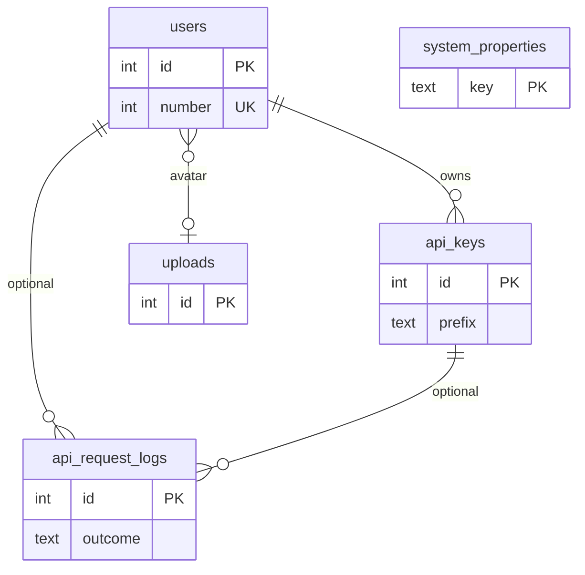

# Platform tables (non-main)

These tables support identity, API access, configuration, and audit logging. They are **not** fully catalogued as domain models here; see [`src/db/schema.ts`](../../src/db/schema.ts) for column-level detail when needed.

On ERDs they appear as compact stubs only. Main domain documentation: [overview](overview.md).

## Inventory

| Table | Purpose | Notable relationships |
|-------|---------|------------------------|
| `users` | App users (single-user now; auth later). Display → **U####**. Holds display name, optional email, password hash, avatar upload, lockout / last-login fields. | Avatar → `uploads` (`ON DELETE SET NULL`). Referenced by tasks (`created_by` / `updated_by`, **RESTRICT**), activity, templates, API keys, request logs. |
| `api_keys` | API keys for admin / programmatic access (prefix + hashed secret, access level, status, expiry). | FK `user_id` → `users` · **CASCADE**. Referenced by `api_request_logs`. |
| `system_properties` | System-wide key/value settings (`key` text PK, `value` jsonb). | Standalone; no FKs. |
| `api_request_logs` | Append-only API / auth audit log (outcome, method, path, status, IP, message, admin-key flag). | Optional FKs to `users` and `api_keys` · **SET NULL**. |

## Minimal relationship sketch

## When to expand this page

If a platform table becomes a first-class product surface (for example full multi-user admin UI with documented enums), promote it to **main** documentation: add a domain section, physical column tables, and update [overview](overview.md) classification — and keep the [schema-docs](../../.cursor/rules/schema-docs.mdc) rule in mind.
