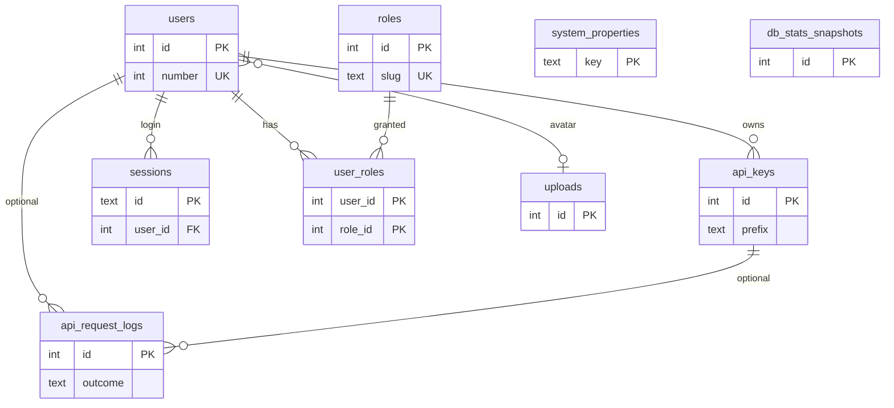

# Platform tables (non-main)

These tables support identity, API access, configuration, and audit logging. They are **not** fully catalogued as domain models here; see [`src/db/schema.ts`](../../src/db/schema.ts) for column-level detail when needed.

On ERDs they appear as compact stubs only. Main domain documentation: [overview](overview.md).

## Inventory

| Table | Purpose | Notable relationships |
|-------|---------|------------------------|
| `users` | App users. Display → **U####**. Email + scrypt password hash for login; avatar upload; lockout / last-login fields. Admins create users (next `U####`, required email + password), **lock** / **unlock** (`locked_at`, distinct from deactivate), and **hard-delete** when the user is not last remaining, not the signed-in user, not the last **Administrator**, and has no RESTRICT authorship/ownership (tasks/ToDos/`owner_id` on domain rows). Deactivate remains the path for users who have authored or own records. Failed sign-in increments `failed_login_count`; at `login_failure_threshold` the account is locked. | Avatar → `uploads` (`ON DELETE SET NULL`). Referenced by `sessions`, `user_roles`, domain `owner_id` (T0112), tasks (`created_by` / `updated_by`, **RESTRICT**), activity, templates, API keys, request logs. |
| `sessions` | Browser login sessions: opaque `id` (httpOnly cookie), `user_id`, `expires_at` (enforced at request time; idle timeout from `session_timeout_minutes`), `created_at`. | FK `user_id` → `users` · **CASCADE**. |
| `roles` | Named roles. Unique `name` and `slug`. System role **Administrator** (`slug: administrator`, `is_system`) is seeded and cannot be renamed or deleted. Custom roles are labels only (T0108); they do not grant Administration. | Referenced by `user_roles`. |
| `user_roles` | User ↔ role membership (composite PK). U0001 is seeded as Administrator. Removing the last Administrator assignment is blocked, as are lock / deactivate / delete of the last Administrator. | FKs `user_id` → `users` · **CASCADE**; `role_id` → `roles` · **CASCADE**. |
| `api_keys` | Programmatic API keys (`taskmesh_{ro\|rw}_…`). Prefix for display; **SHA-256** of full secret in `key_hash`. Access `readonly` \| `readwrite`; status `active` \| `suspended` \| `expired` \| `revoked`. Max **3 active** per user; default/max expiry **60 days**. Request auth via Bearer / X-API-Key (T0063). | FK `user_id` → `users` · **CASCADE**. Referenced by `api_request_logs`. |
| `system_properties` | System-wide key/value settings (`key` text PK, `value` jsonb). Known keys include `api_rate_limit_per_minute`, `login_failure_threshold` (default **3**), `session_timeout_minutes` (default **60**, stored for cookie lifetime and future enforcement), and `default_theme` (accent theme id string, seeded `green`). | Standalone; no FKs. |
| `api_request_logs` | Append-only API / auth audit log (outcome, method, path, status, IP, message, admin-key flag, request/response byte counts). | Optional FKs to `users` and `api_keys` · **SET NULL**. |
| `db_stats_snapshots` | Periodic gauges of the connected app database (size, user table count) for Administration → Database charts. | Standalone; no FKs. |

## Minimal relationship sketch

## When to expand this page

If a platform table becomes a first-class product surface (for example full multi-user admin UI with documented enums), promote it to **main** documentation: add a domain section, physical column tables, and update [overview](overview.md) classification — and keep the [schema-docs](../../.cursor/rules/schema-docs.mdc) rule in mind.
