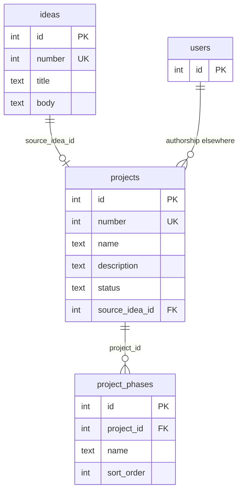

# Projects and ideas

Logical and physical documentation for idea capture and project structure. Source: [`src/db/schema.ts`](../../src/db/schema.ts).

Related: [overview](overview.md) · [tasks](tasks.md) · [glossary](glossary.md)

## Logical model

`users` appears only as a stub; projects do not store `created_by` columns today. Task authorship FKs are documented under [tasks](tasks.md).

---

## `ideas`

Captures early thoughts that may later convert into a project. Display number → **I####**.

### Columns

| Column | Type | Nullable | Default | Notes |
|--------|------|----------|---------|--------|
| `id` | serial | no | — | Primary key |
| `number` | integer | no | — | App-wide unique display number (I####) |
| `title` | text | no | — | |
| `body` | text | yes | — | Markdown / notes |
| `created_at` | timestamptz | no | `now()` | |
| `updated_at` | timestamptz | no | `now()` | |

### Constraints

- **PK:** `id`
- **UNIQUE:** `number`

### Relationships

- Referenced by `projects.source_idea_id` (`ON DELETE SET NULL`) when an idea is converted to a project.

---

## `projects`

Primary product hub. Status defaults to `"idea"`. Display number → **P####**.

### Columns

| Column | Type | Nullable | Default | Notes |
|--------|------|----------|---------|--------|
| `id` | serial | no | — | Primary key |
| `number` | integer | no | — | App-wide unique display number (P####) |
| `name` | text | no | — | |
| `description` | text | yes | — | |
| `status` | text | no | `'idea'` | Lifecycle / status string used by the app |
| `source_idea_id` | integer | yes | — | FK → `ideas.id` |
| `created_at` | timestamptz | no | `now()` | |
| `updated_at` | timestamptz | no | `now()` | |

### Constraints

- **PK:** `id`
- **UNIQUE:** `number`
- **FK:** `source_idea_id` → `ideas.id` · **ON DELETE SET NULL**

### Relationships (outbound ownership)

Projects are parents of phases, tasks (optional), documents, todo lists, modules, boards, wiki nodes, canvases, image boards (optional), and task description templates. See domain pages for cascade behavior.

---

## `project_phases`

Ordered phases within a project (for grouping / filtering tasks).

### Columns

| Column | Type | Nullable | Default | Notes |
|--------|------|----------|---------|--------|
| `id` | serial | no | — | Primary key |
| `project_id` | integer | no | — | FK → `projects.id` |
| `name` | text | no | — | |
| `sort_order` | integer | no | `0` | List ordering |
| `created_at` | timestamptz | no | `now()` | |
| `updated_at` | timestamptz | no | `now()` | |

### Constraints

- **PK:** `id`
- **FK:** `project_id` → `projects.id` · **ON DELETE CASCADE**

### Relationships

- Referenced by `tasks.phase_id` (`ON DELETE SET NULL`).
