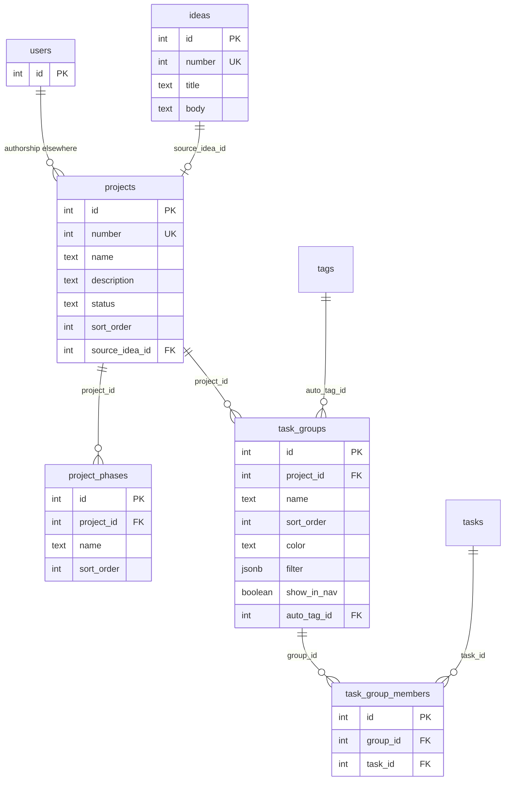

# Projects and ideas

Logical and physical documentation for idea capture and project structure. Source: [`src/db/schema.ts`](../../src/db/schema.ts).

Related: [overview](overview.md) · [tasks](tasks.md) · [glossary](glossary.md)

## Logical model

`users` appears only as a stub; projects do not store `created_by` columns today. Task authorship FKs are documented under [tasks](tasks.md).

---

## `ideas`

Captures early thoughts that may later convert into a project. Display number → **I####**.

### Columns

| Column | Type | Nullable | Default | Notes |
|--------|------|----------|---------|--------|
| `id` | serial | no | — | Primary key |
| `number` | integer | no | — | App-wide unique display number (I####) |
| `title` | text | no | — | |
| `body` | text | yes | — | Markdown / notes |
| `created_at` | timestamptz | no | `now()` | |
| `updated_at` | timestamptz | no | `now()` | |

### Constraints

- **PK:** `id`
- **UNIQUE:** `number`

### Relationships

- Referenced by `projects.source_idea_id` (`ON DELETE SET NULL`) when an idea is converted to a project.

---

## `projects`

Primary product hub. Status defaults to `"idea"`. Display number → **P####**.

### Columns

| Column | Type | Nullable | Default | Notes |
|--------|------|----------|---------|--------|
| `id` | serial | no | — | Primary key |
| `number` | integer | no | — | App-wide unique display number (P####) |
| `name` | text | no | — | |
| `description` | text | yes | — | |
| `status` | text | no | `'idea'` | Lifecycle / status string used by the app |
| `sort_order` | integer | no | `0` | Manual list order (left nav / project list) |
| `source_idea_id` | integer | yes | — | FK → `ideas.id` |
| `created_at` | timestamptz | no | `now()` | |
| `updated_at` | timestamptz | no | `now()` | |

### Constraints

- **PK:** `id`
- **UNIQUE:** `number`
- **FK:** `source_idea_id` → `ideas.id` · **ON DELETE SET NULL**

### Relationships (outbound ownership)

Projects are parents of task groups, project phases, tasks (optional), documents, todo lists, modules, boards, wiki nodes, canvases, image boards (optional), and task description templates. See domain pages for cascade behavior.

---

## `task_groups`

Named list-view sections within a project (T0075). Optional saved filter and bar color. When a **filter is active**, list placement uses that filter **cascaded** with the browser list Filter (T0088): the list Filter is the base; the group filter is ANDed on, except same-field group clauses replace the list’s clauses for that field in this section only. A task may still appear in multiple groups. When the filter is **empty**, the group is a **manual bucket**: tasks are linked via `task_group_members` and can be drag-dropped in List View (T0094); membership is still limited by the list Filter. `show_in_nav` (T0078) opts the group into the Project menu under Tasks when a filter is active (nav sub-list uses the group filter as the list Filter overlay — no second cascade). Optional `auto_tag_id` (T0077) names a tag applied to matching tasks (add-only), including drag-into a filter group after Confirm; auto-tag matching uses the **group filter only**. Filter clause fields: State, Priority, Title, Number, Phase (T0080), Tags, Project.

### Columns

| Column | Type | Nullable | Default | Notes |
|--------|------|----------|---------|--------|
| `id` | serial | no | — | Primary key |
| `project_id` | integer | no | — | FK → `projects.id` |
| `name` | text | no | — | |
| `sort_order` | integer | no | `0` | List ordering |
| `color` | text | yes | — | Accent on the group bar (CSS hex) |
| `filter` | jsonb | yes | — | T0053-shaped `{ clauses, joins }`; null/empty = manual membership |
| `show_in_nav` | boolean | no | `false` | When true and filter is active, appear under Tasks in the Project menu |
| `auto_tag_id` | integer | yes | — | FK → `tags.id`; auto-applied to matching tasks (T0077) |
| `created_at` | timestamptz | no | `now()` | |
| `updated_at` | timestamptz | no | `now()` | |

### Constraints

- **PK:** `id`
- **FK:** `project_id` → `projects.id` · **ON DELETE CASCADE**
- **FK:** `auto_tag_id` → `tags.id` · **ON DELETE SET NULL**

### Relationships

- Owned by `projects`. Filter groups do not FK tasks; manual groups use `task_group_members`. Optional auto-tag via `auto_tag_id`. Project **Phases** (`project_phases`) are a separate table; tasks associate via `tasks.phase_id`.

---

## `task_group_members`

Manual membership for Task Groups that have **no active filter** (T0094). Saving an active filter on a group clears its members. Deleting a group or task cascades.

### Columns

| Column | Type | Nullable | Default | Notes |
|--------|------|----------|---------|--------|
| `id` | serial | no | — | Primary key |
| `group_id` | integer | no | — | FK → `task_groups.id` |
| `task_id` | integer | no | — | FK → `tasks.id` |
| `created_at` | timestamptz | no | `now()` | |

### Constraints

- **PK:** `id`
- **UNIQUE:** `(group_id, task_id)`
- **FK:** `group_id` → `task_groups.id` · **ON DELETE CASCADE**
- **FK:** `task_id` → `tasks.id` · **ON DELETE CASCADE**

### Relationships

- Join between `task_groups` and `tasks` for empty-filter (manual) groups only.

---

## `project_phases`

Named development phases on a project (T0080). Distinct from list-view **Task Groups**. Tasks optionally point at one phase via `tasks.phase_id`. Projects may have zero phases. Deleting a phase sets associated tasks’ `phase_id` to null (`ON DELETE SET NULL`).

### Columns

| Column | Type | Nullable | Default | Notes |
|--------|------|----------|---------|--------|
| `id` | serial | no | — | Primary key |
| `project_id` | integer | no | — | FK → `projects.id` |
| `name` | text | no | — | |
| `sort_order` | integer | no | `0` | Settings list order |
| `created_at` | timestamptz | no | `now()` | |
| `updated_at` | timestamptz | no | `now()` | |

### Constraints

- **PK:** `id`
- **FK:** `project_id` → `projects.id` · **ON DELETE CASCADE**

### Relationships

- Owned by `projects`. Referenced by `tasks.phase_id`.
