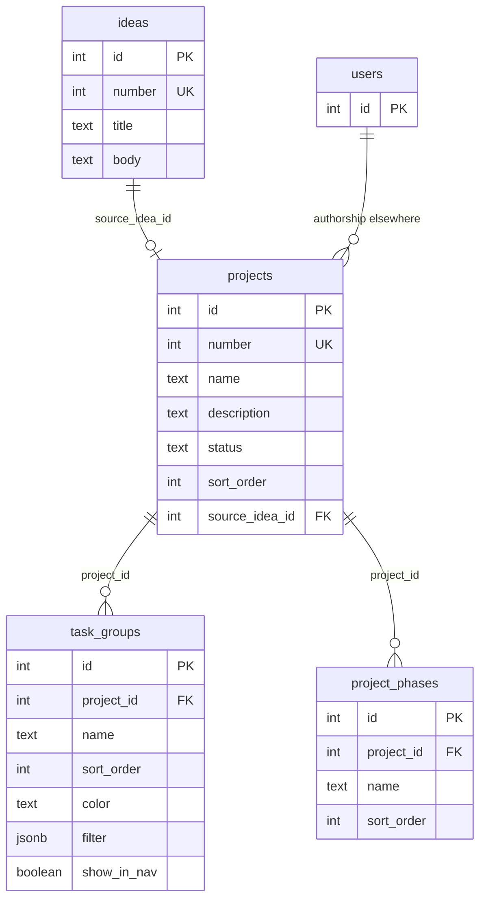

# Projects and ideas

Logical and physical documentation for idea capture and project structure. Source: [`src/db/schema.ts`](../../src/db/schema.ts).

Related: [overview](overview.md) · [tasks](tasks.md) · [glossary](glossary.md)

## Logical model

`users` appears only as a stub; projects do not store `created_by` columns today. Task authorship FKs are documented under [tasks](tasks.md).

---

## `ideas`

Captures early thoughts that may later convert into a project. Display number → **I####**.

### Columns

| Column | Type | Nullable | Default | Notes |
|--------|------|----------|---------|--------|
| `id` | serial | no | — | Primary key |
| `number` | integer | no | — | App-wide unique display number (I####) |
| `title` | text | no | — | |
| `body` | text | yes | — | Markdown / notes |
| `created_at` | timestamptz | no | `now()` | |
| `updated_at` | timestamptz | no | `now()` | |

### Constraints

- **PK:** `id`
- **UNIQUE:** `number`

### Relationships

- Referenced by `projects.source_idea_id` (`ON DELETE SET NULL`) when an idea is converted to a project.

---

## `projects`

Primary product hub. Status defaults to `"idea"`. Display number → **P####**.

### Columns

| Column | Type | Nullable | Default | Notes |
|--------|------|----------|---------|--------|
| `id` | serial | no | — | Primary key |
| `number` | integer | no | — | App-wide unique display number (P####) |
| `name` | text | no | — | |
| `description` | text | yes | — | |
| `status` | text | no | `'idea'` | Lifecycle / status string used by the app |
| `sort_order` | integer | no | `0` | Manual list order (left nav / project list) |
| `source_idea_id` | integer | yes | — | FK → `ideas.id` |
| `created_at` | timestamptz | no | `now()` | |
| `updated_at` | timestamptz | no | `now()` | |

### Constraints

- **PK:** `id`
- **UNIQUE:** `number`
- **FK:** `source_idea_id` → `ideas.id` · **ON DELETE SET NULL**

### Relationships (outbound ownership)

Projects are parents of task groups, project phases, tasks (optional), documents, todo lists, modules, boards, wiki nodes, canvases, image boards (optional), and task description templates. See domain pages for cascade behavior.

---

## `task_groups`

Named list-view sections within a project (T0075). Optional saved filter and bar color. Groups do **not** own tasks via FK; the list UI matches tasks with the stored filter. Empty filter → empty section. `show_in_nav` (T0078) opts the group into the Project menu under Tasks when a filter is active. Filter clause fields: State, Priority, Title, Number, Phase (T0080).

### Columns

| Column | Type | Nullable | Default | Notes |
|--------|------|----------|---------|--------|
| `id` | serial | no | — | Primary key |
| `project_id` | integer | no | — | FK → `projects.id` |
| `name` | text | no | — | |
| `sort_order` | integer | no | `0` | List ordering |
| `color` | text | yes | — | Accent on the group bar (CSS hex) |
| `filter` | jsonb | yes | — | T0053-shaped `{ clauses, joins }`; null/empty = no matches |
| `show_in_nav` | boolean | no | `false` | When true and filter is active, appear under Tasks in the Project menu |
| `created_at` | timestamptz | no | `now()` | |
| `updated_at` | timestamptz | no | `now()` | |

### Constraints

- **PK:** `id`
- **FK:** `project_id` → `projects.id` · **ON DELETE CASCADE**

### Relationships

- Owned by `projects`. Not referenced by `tasks` (list placement is filter-only). Project **Phases** (`project_phases`) are a separate table; tasks associate via `tasks.phase_id`.

---

## `project_phases`

Named development phases on a project (T0080). Distinct from list-view **Task Groups**. Tasks optionally point at one phase via `tasks.phase_id`. Projects may have zero phases. Deleting a phase sets associated tasks’ `phase_id` to null (`ON DELETE SET NULL`).

### Columns

| Column | Type | Nullable | Default | Notes |
|--------|------|----------|---------|--------|
| `id` | serial | no | — | Primary key |
| `project_id` | integer | no | — | FK → `projects.id` |
| `name` | text | no | — | |
| `sort_order` | integer | no | `0` | Settings list order |
| `created_at` | timestamptz | no | `now()` | |
| `updated_at` | timestamptz | no | `now()` | |

### Constraints

- **PK:** `id`
- **FK:** `project_id` → `projects.id` · **ON DELETE CASCADE**

### Relationships

- Owned by `projects`. Referenced by `tasks.phase_id`.
