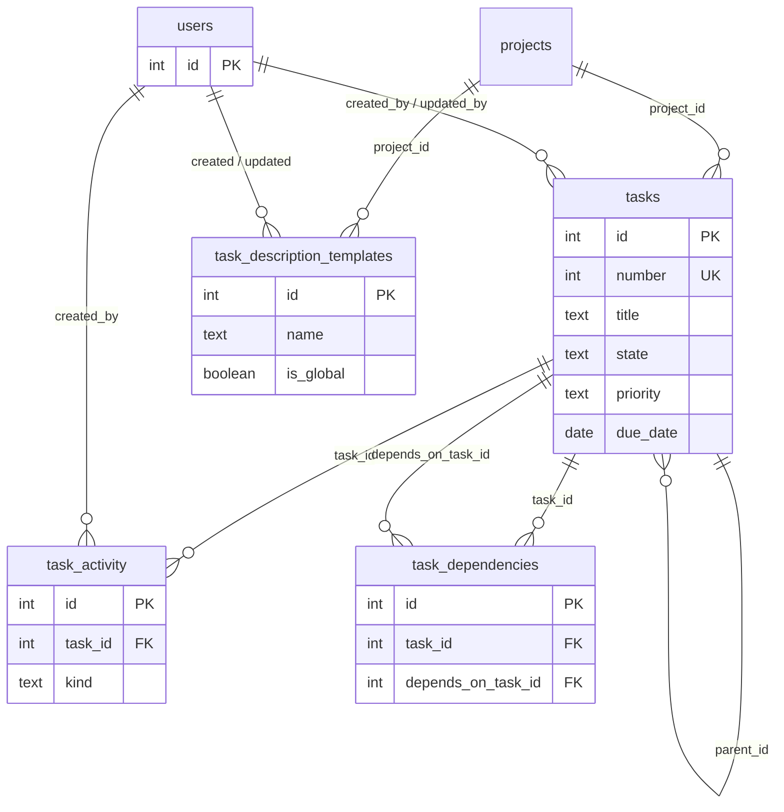

# Tasks

Task records, timeline activity, blocking dependencies, and reusable description templates. Source: [`src/db/schema.ts`](../../src/db/schema.ts).

Related: [overview](overview.md) · [projects and ideas](projects-and-ideas.md) · [glossary](glossary.md)

## Logical model

---

## `tasks`

Work items. May be project-scoped or live only in lists / unsorted (`project_id` null). Display number → **T####**.

Hierarchy (`parent_id`) is separate from **Depends on** edges in `task_dependencies`.

### Columns

| Column | Type | Nullable | Default | Notes |
|--------|------|----------|---------|--------|
| `id` | serial | no | — | Primary key |
| `project_id` | integer | yes | — | FK → `projects.id`; null = unsorted / list-only |
| `phase_id` | integer | yes | — | Unused for list grouping (T0075). Kept for T0080 Project Phase; no FK |
| `parent_id` | integer | yes | — | Self-FK → `tasks.id` (subtask tree) |
| `number` | integer | no | — | App-wide unique display number (T####) |
| `title` | text | no | — | |
| `description` | text | yes | — | Markdown body |
| `state` | text | no | `'new'` | See [task states](glossary.md#task-states) |
| `priority` | text | no | `'none'` | `none` \| `low` \| `medium` \| `high` \| `urgent` |
| `due_date` | date | yes | — | Date-only (`YYYY-MM-DD` string mode in Drizzle) |
| `due_at` | timestamptz | yes | — | **Deprecated**; prefer `due_date` |
| `color` | text | yes | — | Accent (CSS hex string in app) |
| `sort_order` | integer | no | `0` | |
| `created_by_id` | integer | no | — | FK → `users.id` |
| `updated_by_id` | integer | no | — | FK → `users.id` |
| `created_at` | timestamptz | no | `now()` | |
| `updated_at` | timestamptz | no | `now()` | |

### Constraints

- **PK:** `id`
- **UNIQUE:** `number`
- **FK:** `project_id` → `projects.id` · **ON DELETE CASCADE**
- **FK:** `parent_id` → `tasks.id` · **ON DELETE SET NULL**
- **FK:** `created_by_id` → `users.id` · **ON DELETE RESTRICT**
- **FK:** `updated_by_id` → `users.id` · **ON DELETE RESTRICT**

---

## `task_activity`

Append-style timeline: user **comments** and auto-recorded **field changes**.

### Columns

| Column | Type | Nullable | Default | Notes |
|--------|------|----------|---------|--------|
| `id` | serial | no | — | Primary key |
| `task_id` | integer | no | — | FK → `tasks.id` |
| `kind` | text | no | — | `comment` \| `change` |
| `body` | text | yes | — | Comment Markdown; also used for session `summary` text |
| `edited_at` | timestamptz | yes | — | Last edit time for comments |
| `field` | text | yes | — | Change rows: field name; session summaries use `summary` |
| `old_value` | text | yes | — | Display before value |
| `new_value` | text | yes | — | Display after value |
| `created_by_id` | integer | yes | — | FK → `users.id`; null on some legacy rows |
| `source` | text | no | `'api'` | `ui` when SPA sends `X-TaskMesh-Client: ui`; else `api` |
| `created_at` | timestamptz | no | `now()` | |

### Constraints

- **PK:** `id`
- **FK:** `task_id` → `tasks.id` · **ON DELETE CASCADE**
- **FK:** `created_by_id` → `users.id` · **ON DELETE SET NULL**

---

## `task_dependencies`

Directed blocking edges: row means **`task_id` depends on `depends_on_task_id`**. Inverse view in the UI is “Required by”.

### Columns

| Column | Type | Nullable | Default | Notes |
|--------|------|----------|---------|--------|
| `id` | serial | no | — | Primary key |
| `task_id` | integer | no | — | Dependent task |
| `depends_on_task_id` | integer | no | — | Blocker task |
| `created_at` | timestamptz | no | `now()` | |

### Constraints

- **PK:** `id`
- **UNIQUE:** `(task_id, depends_on_task_id)` — `task_dependencies_pair_uidx`
- **FK:** `task_id` → `tasks.id` · **ON DELETE CASCADE**
- **FK:** `depends_on_task_id` → `tasks.id` · **ON DELETE CASCADE**

---

## `task_description_templates`

Reusable Markdown bodies for task descriptions. May be project-scoped or **global** (`is_global`).

### Columns

| Column | Type | Nullable | Default | Notes |
|--------|------|----------|---------|--------|
| `id` | serial | no | — | Primary key |
| `name` | text | no | — | |
| `body` | text | no | — | Markdown template |
| `project_id` | integer | yes | — | Null when saved from unsorted / non-project task |
| `is_global` | boolean | no | `false` | When true, available on all tasks |
| `created_by_id` | integer | yes | — | FK → `users.id` |
| `updated_by_id` | integer | yes | — | FK → `users.id` |
| `created_at` | timestamptz | no | `now()` | |
| `updated_at` | timestamptz | no | `now()` | |

### Constraints

- **PK:** `id`
- **FK:** `project_id` → `projects.id` · **ON DELETE CASCADE**
- **FK:** `created_by_id` → `users.id` · **ON DELETE SET NULL**
- **FK:** `updated_by_id` → `users.id` · **ON DELETE SET NULL**
